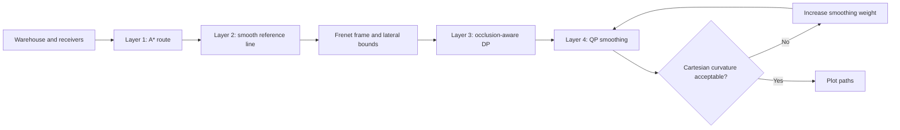

# Occlusion-Aware Path Planning for Warehouse AGVs

**Plan where the positioning system can still see the vehicle.** This MATLAB demo implements the four-layer planner from **“Occlusion-Aware Path Planning to Promote Infrared Positioning Accuracy for Autonomous Driving in a Warehouse”**, published in *Electronics* in 2021.

Shelves and stored goods can block the infrared connection between an emitter on the vehicle and receivers on the ceiling. A collision-free path may therefore pass through locations with poor positioning coverage. This planner incorporates receiver visibility into path selection and smooths the result under geometric constraints.

## Planning pipeline



The first two layers are packaged in `LoadCase.p`. `SearchViaDp.m` exposes the third layer: its edge cost combines length, lateral displacement and receiver visibility. The pointwise occlusion penalty is `4 - min(number_of_valid_receivers, 4)`. Each connection uses both the mean and maximum of sampled occlusion penalties, multiplied by `w_occlusion_awareness`.

`OptimizeViaQp.m` implements the fourth layer. A smooth Frenet path may exceed the curvature bound after conversion to Cartesian coordinates. The code checks Cartesian curvature, doubles the smoothing weight when needed and repeats, subject to its 20-second loop limit. Reaching that limit is not a certificate that the curvature test passed.

## Quick start

Use **MATLAB on Windows** and a working **AMPL/IPOPT** installation. The original executables and support files are supplied; a valid AMPL license and compatible runtime libraries are still needed. Keep the `.p`, `.mod`, `.run` and solver files with the entry script.

```matlab
cd('C:/path/to/OcclusionAwarePathPlanningForAGV');
RunMe;
```

The entry script initializes the warehouse, prepares the reference line, identifies lateral bounds, runs DP and QP, and displays the results. Run from the repository root: MATLAB and AMPL communicate through files resolved relative to the current folder. No MATLAB–AMPL API connector is needed.

The `.p` files are protected MATLAB components executed directly by MATLAB. Their underlying source is not distributed. This planning demo does not require the CarSim environment used for the paper's separate tracking experiments.

## Files and functions

| File or function | Purpose |
| --- | --- |
| `RunMe.m` | Entry point and four-layer orchestration. |
| `InitializeParams.m` | Warehouse, receivers, vehicle, DP and smoothing parameters. |
| `LoadCase.p` | Protected scene/reference-line preparation and first two layers. |
| `IdentifyFrenetLowerUpperBonds.p` | Admissible lateral bounds along the reference line. |
| `SearchViaDp.m` | DP expansion, parent selection and backtracking. |
| `ComputeOcclusionCost` | Local function in `SearchViaDp.m`; penalize fewer than four visible receivers. |
| `IsEgoVehicleConnectedToReceiver` | Local function; sample the 3D emitter–receiver line against warehouse heights. |
| `OptimizeViaQp.m` | Write QP inputs, solve, load paths and adjust smoothing after checking curvature. |
| `XY2SL.p`, `SL2XY.p` | Cartesian/Frenet coordinate transformations. |
| `NLPX.mod`, `rrx.run` | AMPL reference-line model and execution script. |
| `CEM.mod`, `rem.run` | AMPL smoothing model and execution script. |
| `PlotResult.p` | Protected result visualization. |
| `ipopt.opt` | IPOPT options. |

## Configure and interpret the experiment

`InitializeParams.m` defines a 50 × 50 m scene, a 5 m ceiling, height-map obstacles and eight ceiling receivers. The defaults include an 80-by-6 DP sampling arrangement, 200 optimization points, an occlusion weight of 100 and an initial smoothing weight of 0.0001.

Receiver visibility is evaluated against the modeled warehouse geometry; it does not simulate every infrared sensor error. DP searches a finite lattice, and the QP refines the selected route. The paper explains the positioning motivation, layer design and tracking experiments.

## Citation

Please cite the source paper when using this planner or its occlusion-aware formulation:

> Bai Li, Shiqi Tang, Youmin Zhang, and Xiang Zhong, “Occlusion-Aware Path Planning to Promote Infrared Positioning Accuracy for Autonomous Driving in a Warehouse,” *Electronics*, **10**(24), 3093, 2021. [Open-access paper](https://doi.org/10.3390/electronics10243093).

```bibtex
@article{Li2021OcclusionAware,
  author = {Li, Bai and Tang, Shiqi and Zhang, Youmin and Zhong, Xiang},
  title = {Occlusion-Aware Path Planning to Promote Infrared Positioning
           Accuracy for Autonomous Driving in a Warehouse},
  journal = {Electronics},
  volume = {10}, number = {24}, pages = {3093}, year = {2021},
  doi = {10.3390/electronics10243093}
}
```

## License

See the [BSD 3-Clause license](LICENSE). Retain its notices. Bundled external executables and libraries remain subject to their own terms.
